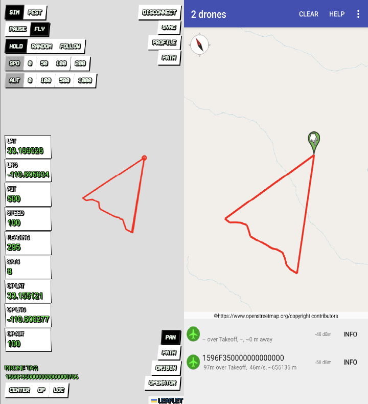
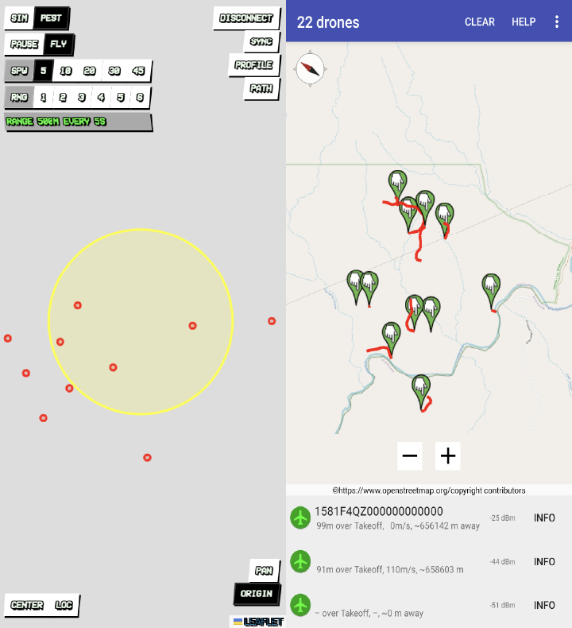
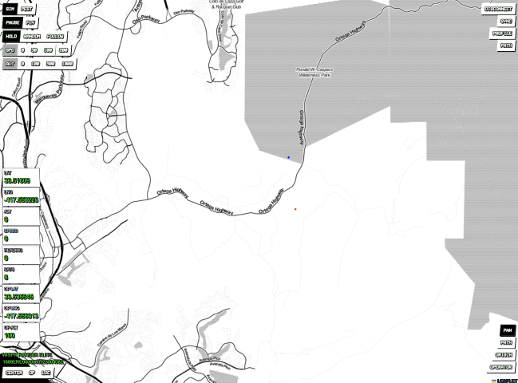

 ```
  _____  ___   __ __  ____  ___    ____   ____  ___
 / ___/ /   \ |  |  ||    ||   \  |    \ |    ||   \
(   \_ |     ||  |  | |  | |    \ |  D  ) |  | |    \
 \__  ||  Q  ||  |  | |  | |  D  ||    /  |  | |  D  |
 /  \ ||     ||  :  | |  | |     ||    \  |  | |     |
 \    ||     ||     | |  | |     ||  .  \ |  | |     |
  \___| \__,_| \__,_||____||_____||__|\_||____||_____|  REMOTE ID 
```

## WHAT IS THIS?

SquidRID is a experimental tool to test and control most of aspects of the FAA RemtoeID protocol. It comes as two parts: Configurator and Firmware. Many options of the protocol are exposed and can be freely configured.

The configurator is accessible at [https://squidrid.flyandi.net](https://squidrid.flyandi.net) but requires Google Chrome.

SquidRID run's on most ESP32 boards and requires the Arduino IDE to upload the firmware.

## Squid Mode

Squid Mode can simulate many aspects of the RemoteID protocol for a single drone instance also called a Squid. 



## Pest Mod

In Pest Mode, SquidRID will spawns x rows every n seconds that are both configurable from the configurator.

 

## IS THIS LEGAL?

Yes and Maybe Not. Many developers that build systems supporting RemoteID require a realistic way to test their implementations and this tool provides a means to do so. This tool also provides additional functionality such as security and penetration testing of RemoteID. 

This tool may be used for educational purposes only and may violate laws or may require a license to operate. Always educate yourself before using this tool.

By using this software you always agree that the author(s) of this software shall under no curcimstances be held liable for the use and/or operation of this software by any party.

## Features
```
[ ] Conforms to Remote ID Standards ASTM F3411-22a
[ ] Exposes most of the usable protocol operations including Operator Location
[ ] Bluetooth only right now / WiFi has to be re-activated 
[ ] Simulation Mode with options for Hold, Random, Follow Path mode. Variable altitude and speed options.
[ ] Pester Mode (Spawns Drones every n seconds, configurable)
```

## Work In Progress

While many parts are ready to use there a few that are still under development:

```
[ ] Ability to run pre-programmed path's.
[ ] Ability to generate dynamic Remote Serial ID's.
[ ] Update Documentation
[ ] Re-enable WiFi support
[ ] Real GPS Support (why not)
```

## Configurator 

)

The Configurator is an easy way to configure your SquidRID Testing Device. Go to [https://squidrid.flyandi.net](https://squidrid.flyandi.net) to access the latest version or run it locally. 
